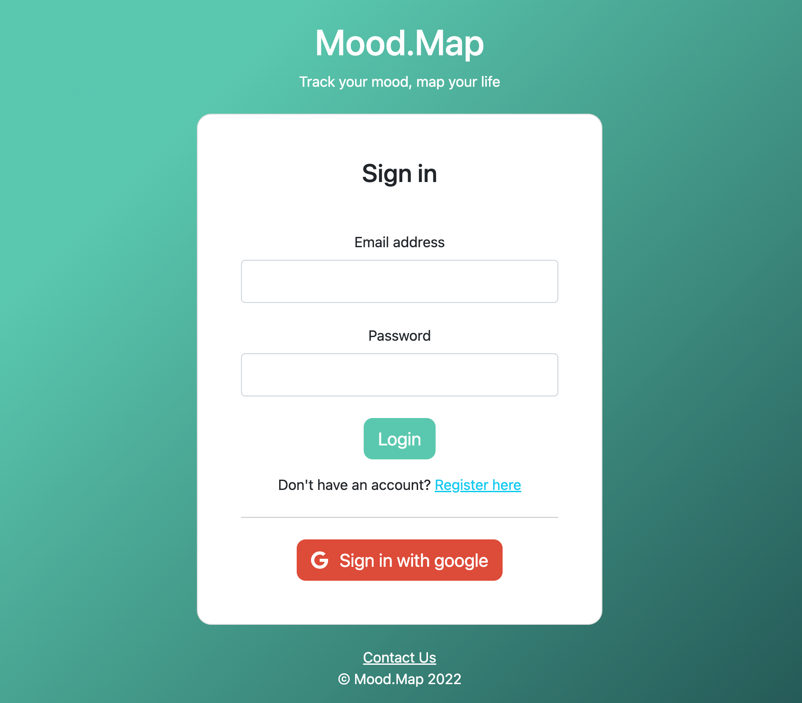

# Mood Map

Mood Map is an mental health focused app built to track your daily mood patterns to help map out a better life.

Users can log in to access their own personal profile containing their daily mood logs. Prompts to access their current mood and reflect on their current emotions will help users be more aware and present of their mental state in order to make positive progress.

## Screenshots



## Tech Stack

Node.js, MongoDB, Express.js, Passport.js, Bootstrap CSS

## Usage

View the live deployment here:

[Mood Map App Live Deployment](https://mood-map.onrender.com/)

## Run Locally

**Requirements before starting:**

- [MongoDB Atlas URI](https://www.mongodb.com/atlas/database)

Install dependencies

```bash
  npm install
```

Create environment variable file

```bash
  cd config
  touch .env
```

Add the following entries to the environment variable file (.env)

```bash
  PORT = 4000
  # MongoDB
  DB_STRING = MONGODB-URI-PLACEHOLDER

```

Start the server

```bash
  npm run start
```

## Authors

- [@JaretBalba](https://www.github.com/jaretzbalba)

## License

[MIT](https://choosealicense.com/licenses/mit/)

## Optimizations

- Complete visual design across all pages
- Integrate React

## Lessons Learned:

- How to use mongoDB's aggregate operations in order to obtain specific doucments created for the current week period.
- How to use checkbox inputs with mongoose schemas
